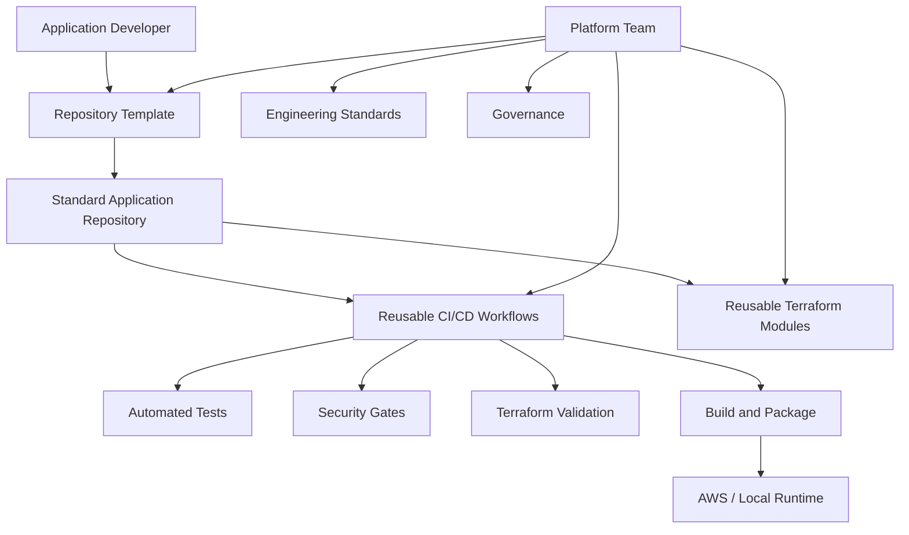

# Platform Engineering Specification

## 1. Purpose

Design a reusable Internal Developer Platform (IDP) for Acme Retail that enables multiple application teams to deliver software through a consistent, secure and maintainable engineering path.

The platform must solve the common organizational problems identified in the capstone: duplicate pipelines, duplicate Terraform, different repository structures, inconsistent AI specifications, long onboarding and high maintenance.

## 2. Platform Principles

- **Standardize common concerns:** teams should not independently implement CI/CD, security scanning, repository conventions or common infrastructure patterns.
- **Reuse before rebuild:** shared capabilities should be consumed as versioned platform components.
- **Secure by default:** security checks are part of the paved path rather than optional afterthoughts.
- **Developer self-service:** application teams should be able to onboard with documented, repeatable steps.
- **Local-first validation:** core validation must work without dedicated cloud infrastructure.
- **Separation of concerns:** platform assets provide common capabilities while application teams retain ownership of business logic.
- **Minimal customization:** application onboarding should require configuration rather than copying and modifying platform logic.

## 3. Scope

### In scope
- Standard repository structure.
- Reusable GitHub Actions workflows.
- Reusable Terraform modules.
- Application containerization.
- Security scanning with Trivy, Checkov and Gitleaks.
- Developer onboarding and documentation.
- Architecture standards and ADRs.
- Governance and ownership conventions.
- Local validation.

### Out of scope
- Implementing the complete IMS business domain.
- Replacing every enterprise developer tool.
- Requiring a live AWS environment for capstone validation.
- Allowing application-specific bypasses of mandatory security controls without governance.

## 4. Logical Platform Architecture

## 5. Platform Capability Contracts

### Repository
Every onboarded application follows the standard directory structure and contains a health endpoint, Dockerfile, documentation and workflow entry points.

### CI/CD
The standard pipeline performs tests, Terraform validation and security checks before an artifact can progress.

### Infrastructure
Terraform modules expose documented inputs and outputs and avoid application-specific duplication.

### Security
Gitleaks detects secrets, Checkov validates infrastructure configuration and Trivy scans the filesystem/container image.

### Governance
Material architectural decisions use ADRs. Platform-owned assets have ownership and controlled change.

## 6. Non-Functional Requirements

- Reproducible locally.
- Deterministic CI stages where practical.
- Least-privilege workflow permissions.
- No secrets committed to source control.
- Shared assets are versionable.
- Failure messages should identify the failed quality/security gate.
- Platform changes should include documentation and migration guidance where compatibility changes.

## 7. Onboarding Acceptance Criteria

A new application team is considered onboarded when it can:

1. Create a repository from the standard structure.
2. Configure application metadata.
3. Run tests locally.
4. Build the application container locally.
5. Validate Terraform without provisioning cloud resources.
6. Open a pull request and receive automated quality/security feedback.
7. Understand ownership, release and exception processes from documentation.

## 8. Platform Ownership

The platform team owns reusable workflows, Terraform modules, templates and standards. Application teams own business logic, service configuration and application-specific tests.

## 9. Risks and Mitigations

| Risk | Mitigation |
|---|---|
| Shared workflow changes break applications | Version workflows and document breaking changes |
| Teams bypass standards | Protect required checks and define governed exceptions |
| Platform becomes a bottleneck | Favor self-service templates and automation |
| Cloud dependency blocks demonstration | Maintain local validation path |
| AI-generated artifacts contain defects | Review, test, scan and validate every generated artifact |

## 10. Definition of Done

The platform capability is complete when the required repository structure, reusable automation, security controls, documentation and local validation are implemented and demonstrated for more than one application onboarding scenario.
