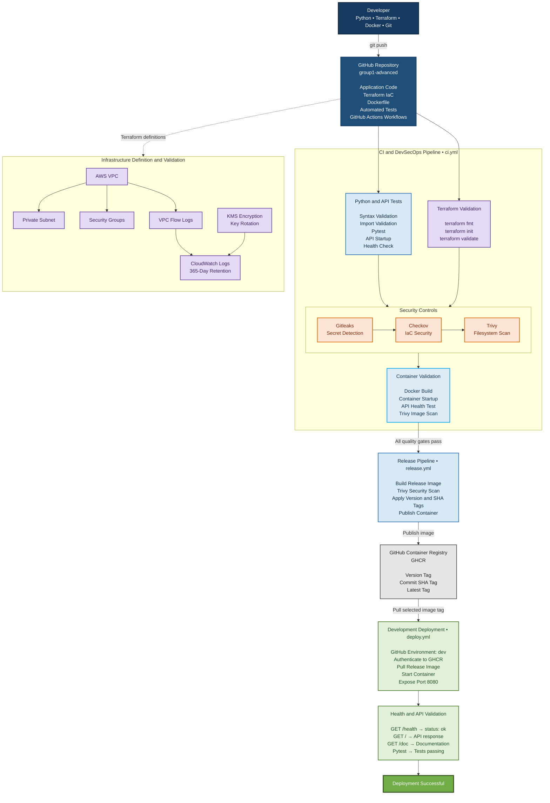
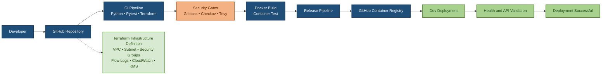

# Group1 Advanced Architecture

## Overview

The `group1-advanced` capstone implements an automated DevSecOps delivery path for a Python API. Application code, tests, infrastructure definitions, container configuration, and GitHub Actions workflows are maintained in one repository.

The solution follows this lifecycle:

**Code → Test → Secure → Build → Release → Deploy → Validate**

## Solution Architecture

## Presentation View

## Component Responsibilities

### GitHub Repository

- Stores the Python API, tests, Dockerfile, Terraform modules, and documentation.
- Stores `ci.yml`, `release.yml`, and `deploy.yml` under `.github/workflows/`.

### CI and DevSecOps Pipeline

- Validates Python syntax and imports.
- Starts the API and runs automated tests.
- Formats, initializes, and validates Terraform.
- Runs Gitleaks, Checkov, and Trivy security checks.
- Builds the Docker image and validates the running container.

### Infrastructure Definition

- Defines the VPC, private subnet, security controls, VPC Flow Logs, CloudWatch logging, and KMS encryption.
- Represents infrastructure definition and validation. It does not imply that the capstone provisioned live AWS infrastructure.

### Release Pipeline

- Builds the release container image.
- Scans the image with Trivy.
- Publishes version, commit SHA, and latest tags to GHCR.

### Development Deployment

- Uses the GitHub `dev` environment.
- Authenticates to GHCR and pulls the selected image tag.
- Runs the container on port 8080.

### Health and API Validation

- Checks `GET /health` for `status: ok`.
- Checks the root API endpoint at `GET /`.
- Checks the documentation endpoint at `GET /doc`.
- Marks deployment successful only after validation passes.
