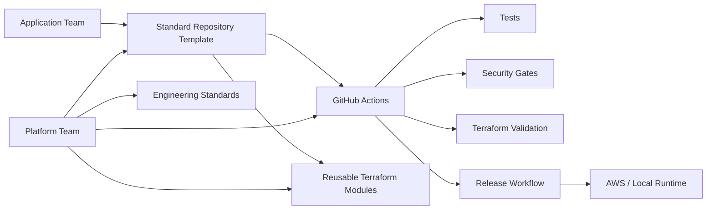

# Platform Architecture

## Platform layers
- Developer experience: templates, README, local commands.
- Delivery: reusable GitHub Actions.
- Infrastructure: reusable Terraform modules.
- Security: Gitleaks, Checkov, Trivy.
- Governance: ADRs, ownership, exception process.
